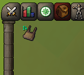
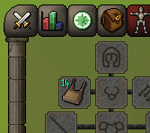

# Log Basket

A RuneLite [plugin](https://runelite.net/plugin-hub/show/log-basket) that tracks and displays the number of logs stored in your log basket (or forestry basket).

&nbsp;&nbsp;&nbsp;&nbsp;&nbsp;&nbsp;&nbsp;&nbsp;&nbsp;&nbsp;

## Features

- Draws the log count on the basket in your inventory & equipment tab
- Automatically increments the count as you cut logs with an _open_ basket
- Detects fills, empties, and partial empties from inventory changes and game messages
- Shows `?` when the count is not yet known; right-click the basket and select `Check` to sync

## Known limitations

- Logs picked up directly off the ground while the basket is open auto-route into the basket, but this is _not_ yet tracked. Use `Check` to resync.

## Installation

Install [Log Basket](https://runelite.net/plugin-hub/show/log-basket) from the _in-game_ RuneLite plugin hub.
