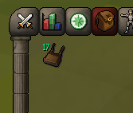

# Log Basket

A [RuneLite](https://runelite.net) plugin that tracks and displays the number of logs stored in your log basket (or forestry basket).

  

## Features

- Draws the current log count on the basket item in your inventory
- Automatically increments the count as you cut logs
- Detects fills, empties, and partial empties from inventory changes and game messages
- Shows `?` when the count is not yet known; right-click the basket and select **Check** to sync

## Configuration

| Option                 | Default | Description                                         |
|------------------------|---------|-----------------------------------------------------|
| Show inventory overlay | On      | Draw the count on the basket item in your inventory |
| Overlay colour         | Green   | Colour used for the count drawn on the basket       |

## Syncing the count

The count is inferred from game events and is almost always accurate. If it ever shows `?` or looks wrong, right-click the basket and select **Check** to resync.

## Known limitations

- Logs picked up directly off the ground while the basket is open auto-route into the basket, but this isn't yet tracked. Use **Check** to resync.

## Installation

Install from the in-game RuneLite Plugin Hub - search for **Log Basket**.
